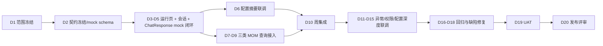

# KM-MOM DataAgent 每日开发计划表

## 1. 使用说明

本计划按 4 周 20 个工作日编排，起始日为 2026-06-08。若项目实际启动日期不同，日期整体顺延，任务顺序不变。截至 2026-06-15，若 D1-D5 未完成契约冻结，应在 D6 前半天补齐，不得带着旧接口草案进入真实编码。

计划目标是让 DataAgent 运行页主流程在 4 周内完成可演示、可联调、可验收的闭环。配置页 8 项的详细维护流程不纳入本计划，只保留运行页必须依赖的配置摘要、状态、推荐问题和跳转联调。

## 2. 每日固定动作

| 时间 | 动作 | 参与人 | 输出 |
| --- | --- | --- | --- |
| 09:30-09:45 | 日站会 | 产品、前端、DataAgent 后端、MOM 后端、配置页负责人、测试 | 昨日完成、今日目标、阻塞项 |
| 11:30-12:00 | 接口/口径同步 | 当日相关负责人 | 当日接口字段、口径或 mock 变更 |
| 16:30-17:30 | 联调窗口 | 前端、后端、测试 | 联调问题清单、责任人、修复时间 |
| 17:30-18:00 | 日终确认 | 产品、研发负责人、测试 | 当日完成项、未完成原因、次日调整 |

## 3. 20 个工作日计划

### 第 1 周：边界冻结、基础骨架、mock 闭环

| 日期 | 日目标 | 上午具体行为 | 下午具体行为 | 当日交付物 | 验收口径 |
| --- | --- | --- | --- | --- | --- |
| D1 2026-06-08 | 启动与范围冻结 | 召开启动会；确认运行页主流程与配置页详细需求边界；确认一期固定包含工单、库存、设备三类查询 | 建立项目任务看板；确认角色负责人；梳理 datamodel、权限、配置摘要、业务口径阻塞项 | 启动会议纪要、责任人表、阻塞项清单 | 运行页不承接配置页 8 项字段级维护流程；所有 P0 阻塞项有责任人 |
| D2 2026-06-09 | 契约冻结与 mock schema | 后端输出 `RuntimeConfig`、`CreateSessionRequest`、`ChatRequest`、`ChatResponse`、`ChatAnswer`、幂等台账、错误码、15s 超时预算；MOM 后端输出三类查询接口草案 | 前端基于冻结契约建立 mock 数据；测试编写首版契约验收用例清单 | 接口契约 v1、mock schema v0.1、测试用例清单 v0.1 | `clientMessageId`、幂等状态、`lockedUntil`、`lastStage`、`persisted`、`traceId`、错误码和配置状态均有字段定义；字段均标注待确认来源 |
| D3 2026-06-10 | 运行页静态框架 | 前端完成页面路由、左侧栏、顶部状态、主空态、底部输入区静态结构 | 前端完成推荐问题卡片和历史会话静态列表；设计/产品走查页面 | 运行页静态页面 | 页面与截图一致性达到可评审状态；无明显布局重叠 |
| D4 2026-06-11 | 会话 mock 闭环 | 后端完成会话创建、历史会话、消息查询 mock 接口；前端接入新会话按钮 | 前端接入历史会话切换和消息列表渲染；测试执行会话冒烟 | 会话 mock 闭环 | 点击新会话生成记录；切换历史会话能加载消息 |
| D5 2026-06-12 | 问答 mock 闭环 | 后端完成 `POST /api/data-agent/chat` mock：三类推荐问题返回 `ChatResponse`，并模拟 `SUCCEEDED/PERSIST_FAILED/PROCESSING 超时` | 前端接入文本发送、推荐问题点击发送、答案展示、pending/失败/重试状态；周评审 | 可演示 mock 版本 v0.1 | 三类推荐问题均可从点击到答案展示闭环；重试复用 `clientMessageId`，后端不重复调用工具，失败持久化不写成功历史 |

### 第 2 周：配置摘要、业务查询适配、权限骨架

| 日期 | 日目标 | 上午具体行为 | 下午具体行为 | 当日交付物 | 验收口径 |
| --- | --- | --- | --- | --- | --- |
| D6 2026-06-15 | 配置摘要接口联调 | 补齐 D1-D5 未冻结项；配置页负责人确认 `DRAFT`、`PUBLISHED`、`DISABLED`、`NO_EFFECTIVE_CONFIG` 和推荐问题字段；后端实现配置摘要 mock | 前端接入配置摘要：推荐问题动态展示、模型/数据源不可用提示 | 配置摘要联调 v0.1、契约冻结补录 | 推荐问题不再前端写死；仅 `PUBLISHED` 且模型可用时能提交问答；草稿不进入问答链路 |
| D7 2026-06-16 | 工单状态统计接口 | MOM 后端确认“当前工单”临时口径；实现工单状态统计 mock 或真实查询 | 问答编排接入工单状态统计；前端展示工单统计结果 | 工单查询链路 v0.1 | 输入工单统计问题返回状态和数量；无权限/无数据可区分 |
| D8 2026-06-17 | 库存安全预警接口 | MOM 后端确认安全库存临时口径；实现低安全库存查询 mock 或真实查询 | 问答编排接入库存查询；前端展示低库存表格 | 库存查询链路 v0.1 | 返回物料、仓库、当前库存、安全库存、缺口 |
| D9 2026-06-18 | 设备停机统计接口 | MOM 后端确认停机时长临时口径；实现设备停机统计 mock 或真实查询 | 问答编排接入设备查询；前端展示停机统计和明细 | 设备查询链路 v0.1 | 返回设备、停机次数、停机时长；未结束停机规则有记录 |
| D10 2026-06-19 | 权限骨架与周集成 | 权限负责人输出权限矩阵 v0.1；后端接入会话权限和业务域权限 mock | 联合集成三类查询；测试执行第一轮集成冒烟；周评审 | 集成版本 v0.2、权限矩阵 v0.1 | 无权限场景能阻断；三类查询主流程均可演示 |

### 第 3 周：真实服务接入、异常处理、语音降级

| 日期 | 日目标 | 上午具体行为 | 下午具体行为 | 当日交付物 | 验收口径 |
| --- | --- | --- | --- | --- | --- |
| D11 2026-06-22 | 问答编排强化 | 后端完善意图识别规则：工单、库存、设备、未知；定义参数缺失处理 | 前端接入澄清问题展示；测试补充意图不明、参数缺失用例 | 问答编排 v0.2 | 未知问题不调用业务接口；参数缺失可追问或使用默认规则 |
| D12 2026-06-23 | 错误码与异常提示 | 后端统一错误码：配置不可用、模型不可用、数据源不可用、无权限、会话越权、意图不明、参数缺失、口径缺失、消息持久化失败、工具超时、限流；明确无数据为成功空结果 | 前端完成错误提示映射；测试执行异常、持久化失败、限流、口径缺失、无数据成功态场景用例 | 错误码表、异常提示 v0.1 | 错误不暴露技术细节；`NO_DATA` 不作为错误码；`MESSAGE_PERSIST_FAILED` 不写成功历史；`RATE_LIMITED` 不触发重复工具调用 |
| D13 2026-06-24 | 数据权限过滤 | 后端将组织/工厂/车间/仓库范围带入三类查询；MOM 后端校验过滤逻辑 | 测试构造越权数据；验证不会返回授权范围外数据 | 权限过滤 v0.1 | 越权查询被拒绝或结果被过滤；审计日志可追踪 |
| D14 2026-06-25 | 语音入口处理 | 产品确认一期语音仅做入口降级；语音转写接口、音频留存、转写失败错误码后续专项冻结 | 前端接入语音可用状态；测试验证语音不可用或未接入不影响文本问答 | 语音降级方案 | 语音不进入一期问答主链路；文本主流程不受影响 |
| D15 2026-06-26 | 配置模块深度联调 | 与配置页团队联调前往运行页面、配置摘要、生效状态、推荐问题发布后展示 | 周集成测试；修复配置草稿误用、推荐问题刷新、跳转参数问题 | 配置联调版本 v0.3 | 草稿未生效不被运行页误用；发布后运行页读取最新摘要 |

### 第 4 周：验收收敛、UAT、上线准备

| 日期 | 日目标 | 上午具体行为 | 下午具体行为 | 当日交付物 | 验收口径 |
| --- | --- | --- | --- | --- | --- |
| D16 2026-06-29 | UI 和交互收敛 | 前端修复布局、滚动、表格溢出、输入框状态、按钮禁用态 | 产品/设计走查；测试执行 UI 回归 | UI 收敛版本 v0.4 | 主要视口无重叠；关键按钮状态明确 |
| D17 2026-06-30 | 业务口径冻结 | 业务负责人冻结当前工单、安全库存、停机时长口径；后端同步结构化 `MetricDefinition v1.0` 默认版本和发布状态 | 测试将口径写入验收断言；修复与口径不一致的查询逻辑 | 口径确认表 v1.0、结构化口径配置 | 三类查询结果能按口径解释和复现；RAG 不决定口径是否可调用 |
| D18 2026-07-01 | 全量测试与缺陷修复 | 测试执行主流程、异常、权限、配置依赖、语音降级、安全攻击、幂等重试、`PROCESSING` 超时恢复、工具调用前崩溃、工具调用后崩溃、持久化失败、限流、无数据成功态全量用例 | 研发按优先级修复 P0/P1 缺陷；产品确认遗留 P2 | 测试报告 v0.1、缺陷清单、安全评测结果 | P0 全部关闭；`lastStage` 在 `CALL_TOOL` 前超时可抢占继续；`lastStage=CALL_TOOL` 后超时不得自动重放真实工具；提示词注入、SQL 诱导、身份伪造、未注册工具调用不得扩大权限或泄露内部信息 |
| D19 2026-07-02 | UAT 演示准备 | 准备演示数据：工单、低库存物料、设备停机、无权限、无配置 | 产品组织 UAT 演示；记录反馈；研发修复关键问题 | UAT 反馈表、演示脚本 | 业务用户能完成三类查询验收 |
| D20 2026-07-03 | 发布评审与交付 | 整理接口文档、配置依赖说明、测试报告、已知风险、监控与回滚清单 | 发布评审；确认上线/试运行清单、功能开关、告警责任人、回滚动作；冻结后续优化项 | 发布评审材料、试运行清单、监控告警表、回滚方案 | 具备试运行条件；功能开关、回滚、P95/P99、错误码分布、`MESSAGE_PERSIST_FAILED`、`AUDIT_LOG_FAILED`、`RATE_LIMITED` 均可观测 |

## 4. 每日行为拆解模板

每个工作日结束前必须完成以下记录：

| 项目 | 填写要求 |
| --- | --- |
| 今日完成 | 写实际完成的接口、页面、测试、文档，不写泛泛进度 |
| 今日未完成 | 写未完成原因：口径未定、接口阻塞、开发延期、测试缺陷 |
| 明日第一动作 | 写明早第一件可执行动作，避免站会后再重新组织 |
| 新增风险 | 写影响范围和责任人 |
| 需要用户/产品确认 | 写具体问题，不写“待确认”三个字结束 |

## 5. 关键路径

## 6. 不同阻塞情况下的调整规则

| 阻塞 | 不等待的替代动作 | 不允许做的事 |
| --- | --- | --- |
| datamodel 未到 | 使用 mock schema 开发字段映射层 | 把 mock 字段写成正式字段 |
| 配置状态未定 | 按 `NO_EFFECTIVE_CONFIG` 或非 `PUBLISHED` 不可用实现 | 自行定义草稿回退规则或读取草稿工具配置 |
| 权限矩阵未定 | 默认最小权限和本人会话权限 | 接真实数据绕过权限 |
| 业务口径未定 | 使用临时口径并标记版本 | 进入正式验收 |
| 语音服务延期 | 语音入口置灰或提示不可用，保留文本主流程 | 阻塞问数主流程或临时接入未冻结转写接口 |

## 7. 每周验收点

| 周次 | 验收重点 | 不通过则调整 |
| --- | --- | --- |
| 第 1 周 | 契约是否冻结、mock 闭环是否可演示 | 不进入真实接口接入，先补齐 `ChatResponse`、幂等、配置状态和问答闭环 |
| 第 2 周 | 三类业务查询是否跑通 | 未跑通的查询降级为 mock，但必须保留接口契约问题 |
| 第 3 周 | 权限、异常、配置依赖是否可控 | 不进入 UAT，优先修复安全和错误提示 |
| 第 4 周 | UAT 是否能验证主流程，监控与回滚是否可用 | 不发布正式版本，只进入受控试运行 |
