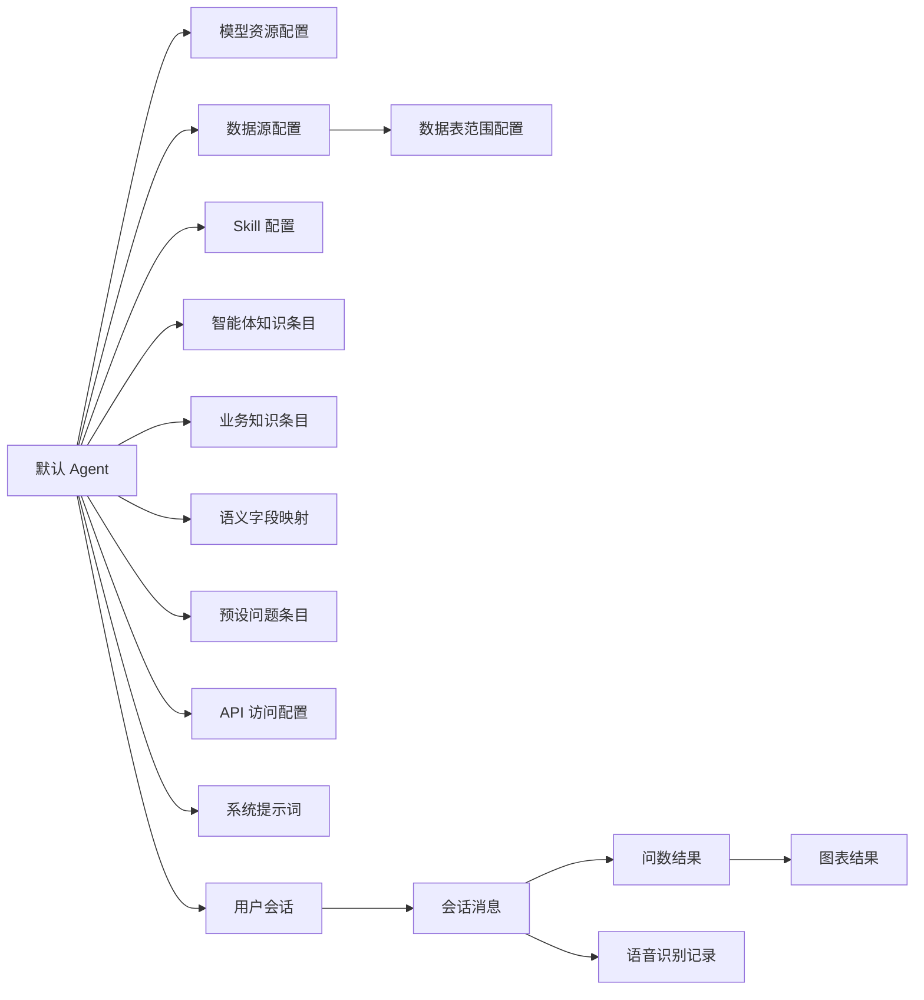

# MOM智能问数-MVP数据模型文档

## 1. 文档说明

本文档用于定义 MOM 智能问数 MVP 的核心数据对象、字段口径、对象关系和状态规则，作为管理侧与用户侧需求规格文档的配套文档。

本文档不再拆分为管理侧数据模型文档和用户侧数据模型文档，但正文仍按功能分为两部分：

- 管理侧配置数据模型：支撑默认 Agent 的模型、数据源、知识、语义、Skill、预设问题和访问 API 配置。
- 用户侧运行数据模型：支撑会话管理、会话展示、文本问数、语音问数和问数结果展示。

## 2. 建模原则

### 2.1 单默认 Agent

MVP 阶段仅支持一个默认 Agent。管理侧所有配置均归属于该默认 Agent，用户侧不选择 Agent。

### 2.2 管理侧与用户侧分层

管理侧负责配置默认 Agent 能力，用户侧负责消费配置完整可用的默认 Agent 能力（配置生效）并完成问数交互。

### 2.3 系统提示词内置

系统提示词属于运行时内置能力，不作为用户可编辑配置，不提供自定义提示词配置页。

### 2.4 语音识别纳入 MVP

语音识别属于 MVP 必做能力，模型资源配置中需要包含语音识别模型，用户侧需要支持语音问数。

### 2.5 访问 API 归属管理侧

访问 API 属于管理侧能力，用于外部系统接入默认 Agent。用户侧不维护 API Key、调用说明和外部接入能力。

### 2.6 用户鉴权不纳入 MVP

MVP 阶段不单独建设用户鉴权管理和用户登录注册管理，用户侧入口按当前系统可访问范围开放。

## 3. 核心对象关系

## 4. 管理侧配置数据模型

### 4.1 默认 Agent

默认 Agent 是管理侧配置与用户侧问数运行的归属主体。

| 字段编码 | 字段名称 | 类型 | 必填 | 说明 |
|---|---|---|---|---|
| agentId | Agent 标识 | 字符串 | 是 | 默认 Agent 唯一标识 |
| agentName | Agent 名称 | 字符串 | 是 | 页面展示名称 |
| agentStatus | Agent 状态 | 枚举 | 是 | 标识当前是否可用 |
| isDefault | 是否默认 | 布尔 | 是 | MVP 固定为是 |
| createdTime | 创建时间 | 日期时间 | 否 | 创建时间 |
| updatedTime | 更新时间 | 日期时间 | 否 | 最近更新时间 |

### 4.2 模型资源配置

模型资源配置用于维护默认 Agent 依赖的大语言模型、嵌入模型和语音识别模型。

| 字段编码 | 字段名称 | 类型 | 必填 | 说明 |
|---|---|---|---|---|
| modelConfigId | 模型配置标识 | 字符串 | 是 | 模型配置唯一标识 |
| agentId | Agent 标识 | 字符串 | 是 | 所属默认 Agent |
| configName | 配置名称 | 字符串 | 是 | 页面展示名称 |
| modelCategory | 模型分类 | 枚举 | 是 | LLM、EMBEDDING、ASR |
| provider | 供应商 | 字符串 | 是 | 模型供应商名称 |
| baseUrl | 服务地址 | 字符串 | 是 | 模型服务访问地址 |
| apiKey | 访问密钥 | 字符串 | 是 | 敏感字段，页面脱敏展示 |
| modelName | 模型名称 | 字符串 | 是 | 具体模型标识 |
| requestMode | 调用模式 | 枚举 | 否 | 流式、非流式 |
| temperature | 温度参数 | 数值 | 否 | 主要用于 LLM |
| maxTokens | 最大输出长度 | 整数 | 否 | 主要用于 LLM |
| enabledFlag | 启用状态 | 布尔 | 是 | 是否可用 |
| defaultFlag | 生效状态 | 布尔 | 是 | 同一模型分类下仅允许一条生效配置 |
| testStatus | 测试状态 | 枚举 | 否 | 未测试、成功、失败 |
| testMessage | 测试结果说明 | 字符串 | 否 | 成功提示或失败原因 |
| lastTestTime | 最近测试时间 | 日期时间 | 否 | 最近一次测试时间 |
| remark | 备注 | 字符串 | 否 | 扩展说明 |

### 4.3 数据源配置

数据源配置用于维护默认 Agent 可访问的 MOM 业务数据库连接。

| 字段编码 | 字段名称 | 类型 | 必填 | 说明 |
|---|---|---|---|---|
| datasourceId | 数据源标识 | 字符串 | 是 | 数据源唯一标识 |
| agentId | Agent 标识 | 字符串 | 是 | 所属默认 Agent |
| datasourceName | 数据源名称 | 字符串 | 是 | 页面展示名称 |
| datasourceType | 数据源类型 | 枚举 | 是 | MySQL、达梦、Oracle、SQL Server、PostgreSQL 等 |
| host | 主机地址 | 字符串 | 是 | 数据库地址 |
| port | 端口 | 整数 | 是 | 数据库端口 |
| databaseName | 数据库名称 | 字符串 | 是 | 目标库名称 |
| username | 用户名 | 字符串 | 是 | 连接用户名 |
| password | 密码 | 字符串 | 是 | 敏感字段，页面脱敏展示 |
| connectionUrl | 连接地址 | 字符串 | 否 | 完整连接串 |
| enabledFlag | 启用状态 | 布尔 | 是 | 是否启用 |
| activeFlag | 当前生效状态 | 布尔 | 是 | 是否作为当前问数链路生效数据源 |
| connectStatus | 连接状态 | 枚举 | 否 | 未测试、成功、失败 |
| connectMessage | 连接结果说明 | 字符串 | 否 | 连接失败原因 |
| schemaInitStatus | Schema 初始化状态 | 枚举 | 否 | 未初始化、初始化中、成功、失败 |
| lastInitTime | 最近初始化时间 | 日期时间 | 否 | 最近一次初始化完成时间 |
| tableCount | 表数量 | 整数 | 否 | 初始化后统计值 |
| fieldCount | 字段数量 | 整数 | 否 | 初始化后统计值 |
| remark | 备注 | 字符串 | 否 | 扩展说明 |

### 4.4 数据表范围配置

数据表范围配置用于定义某个数据源下哪些表纳入问数范围。

| 字段编码 | 字段名称 | 类型 | 必填 | 说明 |
|---|---|---|---|---|
| tableScopeId | 表范围标识 | 字符串 | 是 | 范围记录唯一标识 |
| datasourceId | 数据源标识 | 字符串 | 是 | 所属数据源 |
| tableName | 表名 | 字符串 | 是 | 物理表名 |
| tableComment | 表说明 | 字符串 | 否 | 业务解释 |
| fieldCount | 字段数量 | 整数 | 否 | 该表字段数量 |
| inQueryScope | 是否纳入问数范围 | 布尔 | 是 | 控制是否参与问数 |
| isCoreTable | 是否核心表 | 布尔 | 否 | 标记核心业务表 |
| sortOrder | 排序号 | 整数 | 否 | 页面展示顺序 |
| updatedTime | 更新时间 | 日期时间 | 否 | 最近更新时间 |

### 4.5 Skill 配置

Skill 配置用于维护默认 Agent 可调用的能力白名单。

| 字段编码 | 字段名称 | 类型 | 必填 | 说明 |
|---|---|---|---|---|
| skillId | Skill 标识 | 字符串 | 是 | Skill 唯一标识 |
| agentId | Agent 标识 | 字符串 | 是 | 所属默认 Agent |
| skillCode | Skill 编码 | 字符串 | 是 | 调用编码 |
| skillName | Skill 名称 | 字符串 | 是 | 页面展示名称 |
| sourceType | 来源类型 | 枚举 | 是 | 系统内置、导入 |
| version | 版本号 | 字符串 | 否 | 版本信息 |
| enabledFlag | 启用状态 | 布尔 | 是 | 是否允许默认 Agent 调用 |
| testStatus | 测试状态 | 枚举 | 否 | 未测试、成功、失败 |
| description | 能力说明 | 字符串 | 否 | Skill 说明 |
| importTime | 导入时间 | 日期时间 | 否 | 导入类 Skill 使用 |
| updatedTime | 更新时间 | 日期时间 | 否 | 最近更新时间 |

### 4.6 智能体知识条目

智能体知识条目用于管理文档、问答对和 FAQ 类知识。

| 字段编码 | 字段名称 | 类型 | 必填 | 说明 |
|---|---|---|---|---|
| knowledgeId | 知识标识 | 字符串 | 是 | 知识条目唯一标识 |
| agentId | Agent 标识 | 字符串 | 是 | 所属默认 Agent |
| knowledgeType | 知识类型 | 枚举 | 是 | 文档、问答对、FAQ |
| knowledgeTitle | 知识标题 | 字符串 | 是 | 页面展示标题 |
| sourceFileName | 源文件名 | 字符串 | 否 | 文档知识使用 |
| sourceFileType | 文件类型 | 字符串 | 否 | 文档知识使用 |
| splitterType | 分块方式 | 枚举 | 否 | 文档分块策略 |
| question | 问题 | 字符串 | 条件必填 | 问答对、FAQ 使用 |
| answerContent | 答案内容 | 长文本/CLOB | 条件必填 | 问答对、FAQ 使用 |
| recallFlag | 是否参与召回 | 布尔 | 是 | 控制是否纳入问数召回 |
| vectorStatus | 向量状态 | 枚举 | 否 | 待处理、处理中、成功、失败 |
| vectorMessage | 向量结果说明 | 字符串 | 否 | 失败原因或处理说明 |
| createdTime | 创建时间 | 日期时间 | 否 | 创建时间 |
| updatedTime | 更新时间 | 日期时间 | 否 | 最近更新时间 |

### 4.7 业务知识条目

业务知识条目用于维护业务术语、业务描述和同义词。

| 字段编码 | 字段名称 | 类型 | 必填 | 说明 |
|---|---|---|---|---|
| termId | 术语标识 | 字符串 | 是 | 业务知识唯一标识 |
| agentId | Agent 标识 | 字符串 | 是 | 所属默认 Agent |
| termName | 业务名词 | 字符串 | 是 | 如工单、库存、设备停机 |
| description | 业务描述 | 长文本/CLOB | 是 | 对术语含义的说明 |
| synonyms | 同义词 | 字符串 | 否 | 多值可按分隔符维护 |
| tagNames | 标签 | 字符串 | 否 | 用于分类展示和筛选 |
| enabledFlag | 启用状态 | 布尔 | 是 | 是否启用 |
| recallFlag | 是否参与召回 | 布尔 | 是 | 控制是否参与问数召回 |
| vectorStatus | 向量状态 | 枚举 | 否 | 待处理、处理中、成功、失败 |
| vectorMessage | 向量结果说明 | 字符串 | 否 | 失败原因或处理说明 |
| createdTime | 创建时间 | 日期时间 | 否 | 创建时间 |
| updatedTime | 更新时间 | 日期时间 | 否 | 最近更新时间 |

### 4.8 语义字段映射

语义字段映射用于维护“数据库字段 - 业务字段”的结构化语义关系。

| 字段编码 | 字段名称 | 类型 | 必填 | 说明 |
|---|---|---|---|---|
| semanticId | 映射标识 | 字符串 | 是 | 映射记录唯一标识 |
| agentId | Agent 标识 | 字符串 | 是 | 所属默认 Agent |
| datasourceId | 数据源标识 | 字符串 | 是 | 所属数据源 |
| tableName | 表名 | 字符串 | 是 | 物理表名 |
| columnName | 字段名 | 字符串 | 是 | 物理字段名 |
| businessName | 业务名称 | 字符串 | 是 | 字段对应的业务化名称 |
| synonyms | 同义词 | 字符串 | 否 | 字段业务同义词 |
| businessDescription | 业务描述 | 长文本/CLOB | 否 | 字段业务解释 |
| columnComment | 字段注释 | 字符串 | 否 | 来源于库表注释 |
| dataType | 数据类型 | 字符串 | 是 | 字段类型 |
| enabledFlag | 启用状态 | 布尔 | 是 | 是否参与问数语义约束 |
| createdTime | 创建时间 | 日期时间 | 否 | 创建时间 |
| updatedTime | 更新时间 | 日期时间 | 否 | 最近更新时间 |

说明：

- 语义字段映射属于结构化语义约束，不属于知识召回。
- 语义字段映射直接服务于字段理解、口径约束和提示词注入。

### 4.9 预设问题条目

预设问题条目用于维护用户侧首页或输入区展示的问题列表。正式对象名为预设问题，用户侧展示时可称为推荐问题。

| 字段编码 | 字段名称 | 类型 | 必填 | 说明 |
|---|---|---|---|---|
| presetQuestionId | 预设问题标识 | 字符串 | 是 | 预设问题唯一标识 |
| agentId | Agent 标识 | 字符串 | 是 | 所属默认 Agent |
| questionTitle | 问题标题 | 字符串 | 否 | 页面展示标题 |
| questionContent | 问题内容 | 字符串 | 是 | 展示给用户的问题文本 |
| questionCategory | 问题分类 | 枚举 | 否 | 工单、库存、设备等 |
| displayScene | 展示场景 | 枚举 | 否 | 首页、输入区等 |
| sortOrder | 排序号 | 整数 | 是 | 控制展示顺序 |
| enabledFlag | 启用状态 | 布尔 | 是 | 是否展示给用户 |
| homeDisplayFlag | 是否首页展示 | 布尔 | 否 | 是否展示在首页卡片区 |
| updatedTime | 更新时间 | 日期时间 | 否 | 最近更新时间 |

### 4.10 API 访问配置

API 访问配置属于管理侧能力，用于外部系统接入默认 Agent。

| 字段编码 | 字段名称 | 类型 | 必填 | 说明 |
|---|---|---|---|---|
| apiAccessId | API 访问配置标识 | 字符串 | 是 | API 访问配置唯一标识 |
| agentId | Agent 标识 | 字符串 | 是 | 所属默认 Agent |
| apiEnabledFlag | API 启用状态 | 布尔 | 是 | 控制外部接口是否可访问默认 Agent |
| keyStatus | Key 状态 | 枚举 | 是 | 未生成、有效、已删除、已失效 |
| keyDigest | Key 摘要 | 字符串 | 否 | 用于校验，不保存明文 |
| maskedKey | 脱敏 Key | 字符串 | 否 | 页面展示脱敏值 |
| generatedTime | 生成时间 | 日期时间 | 否 | 最近一次生成时间 |
| resetTime | 重置时间 | 日期时间 | 否 | 最近一次重置时间 |
| deletedTime | 删除时间 | 日期时间 | 否 | 删除时间 |
| invokeUrl | 调用地址 | 字符串 | 是 | 默认 Agent 外部调用地址 |
| requestExample | 请求示例 | 长文本/CLOB | 否 | 页面展示调用示例 |
| responseExample | 返回示例 | 长文本/CLOB | 否 | 页面展示返回示例 |
| updatedTime | 更新时间 | 日期时间 | 否 | 最近更新时间 |

说明：

- MVP 阶段只支持一个有效 API Key。
- 完整 API Key 仅在生成或重置成功后展示一次。
- 用户侧不维护 API 访问配置。

### 4.11 系统提示词

系统提示词为内置运行对象，不对用户开放编辑。

| 字段编码 | 字段名称 | 类型 | 必填 | 说明 |
|---|---|---|---|---|
| promptVersion | 提示词版本 | 字符串 | 是 | 当前内置版本号 |
| promptContent | 提示词内容 | 长文本/CLOB | 是 | 系统运行时使用 |
| enabledFlag | 生效状态 | 布尔 | 是 | 当前是否启用 |
| updatedTime | 更新时间 | 日期时间 | 否 | 最近更新时间 |

## 5. 用户侧运行数据模型

### 5.1 用户会话

用户会话用于承载用户与默认 Agent 的一次连续问答上下文，并支持历史会话管理。

| 字段编码 | 字段名称 | 类型 | 必填 | 说明 |
|---|---|---|---|---|
| sessionId | 会话标识 | 字符串 | 是 | 会话唯一标识 |
| agentId | Agent 标识 | 字符串 | 是 | 固定关联默认 Agent |
| sessionTitle | 会话标题 | 字符串 | 是 | 左侧历史会话展示标题 |
| pinnedFlag | 是否置顶 | 布尔 | 是 | 置顶会话优先展示 |
| deletedFlag | 是否删除 | 布尔 | 是 | 删除后不在历史会话列表展示 |
| lastMessageSummary | 最近消息摘要 | 字符串 | 否 | 历史会话列表展示使用 |
| messageCount | 消息数量 | 整数 | 否 | 会话内消息数量 |
| lastActiveTime | 最近活跃时间 | 日期时间 | 否 | 历史会话排序依据 |
| createdTime | 创建时间 | 日期时间 | 否 | 创建时间 |
| updatedTime | 更新时间 | 日期时间 | 否 | 最近更新时间 |

### 5.2 会话消息

会话消息用于记录用户消息、Agent 回复和系统提示。

| 字段编码 | 字段名称 | 类型 | 必填 | 说明 |
|---|---|---|---|---|
| messageId | 消息标识 | 字符串 | 是 | 消息唯一标识 |
| sessionId | 会话标识 | 字符串 | 是 | 所属会话 |
| agentId | Agent 标识 | 字符串 | 是 | 固定关联默认 Agent |
| messageRole | 消息角色 | 枚举 | 是 | 用户、Agent、系统 |
| inputType | 输入类型 | 枚举 | 是 | 文本、语音、预设问题、系统 |
| messageContent | 消息内容 | 长文本/CLOB | 是 | 用户输入、识别文本或 Agent 回复 |
| displayContent | 展示内容 | 长文本/CLOB | 否 | 页面展示文本，可与消息内容一致 |
| messageStatus | 消息状态 | 枚举 | 是 | 处理中、成功、失败 |
| errorMessage | 错误说明 | 字符串 | 否 | 失败原因或异常提示 |
| createdTime | 创建时间 | 日期时间 | 否 | 消息创建时间 |

### 5.3 语音识别记录

语音识别记录用于支撑语音问数，记录语音输入识别后的文本和识别状态。

| 字段编码 | 字段名称 | 类型 | 必填 | 说明 |
|---|---|---|---|---|
| voiceRecordId | 语音记录标识 | 字符串 | 是 | 语音识别记录唯一标识 |
| sessionId | 会话标识 | 字符串 | 是 | 所属会话 |
| messageId | 消息标识 | 字符串 | 是 | 对应用户消息 |
| audioFileRef | 音频文件引用 | 字符串 | 否 | 音频存储引用，按实现决定是否保留 |
| recognizedText | 识别文本 | 长文本/CLOB | 否 | 语音识别后的文本 |
| recognizeStatus | 识别状态 | 枚举 | 是 | 处理中、成功、失败 |
| confidence | 置信度 | 数值 | 否 | 语音识别置信度 |
| durationSeconds | 音频时长 | 数值 | 否 | 单位：秒 |
| errorMessage | 失败原因 | 字符串 | 否 | 识别失败时记录 |
| createdTime | 创建时间 | 日期时间 | 否 | 创建时间 |

### 5.4 问数结果

问数结果用于记录默认 Agent 对一次用户问题返回的结果摘要和结果类型。

| 字段编码 | 字段名称 | 类型 | 必填 | 说明 |
|---|---|---|---|---|
| resultId | 结果标识 | 字符串 | 是 | 问数结果唯一标识 |
| sessionId | 会话标识 | 字符串 | 是 | 所属会话 |
| messageId | 消息标识 | 字符串 | 是 | 对应用户问题或 Agent 回复 |
| resultType | 结果类型 | 枚举 | 是 | 文本、表格、指标卡、图表、澄清、错误 |
| resultTitle | 结果标题 | 字符串 | 否 | 展示标题 |
| resultSummary | 结果摘要 | 长文本/CLOB | 否 | 简要分析结论 |
| resultStatus | 结果状态 | 枚举 | 是 | 处理中、成功、失败、无数据 |
| errorMessage | 错误说明 | 字符串 | 否 | 失败原因或异常提示 |
| createdTime | 创建时间 | 日期时间 | 否 | 创建时间 |

### 5.5 表格结果

表格结果用于展示明细清单类问数结果。

| 字段编码 | 字段名称 | 类型 | 必填 | 说明 |
|---|---|---|---|---|
| tableResultId | 表格结果标识 | 字符串 | 是 | 表格结果唯一标识 |
| resultId | 结果标识 | 字符串 | 是 | 所属问数结果 |
| tableTitle | 表格标题 | 字符串 | 否 | 展示标题 |
| columnsJson | 表头定义 | JSON/CLOB | 是 | 列名、列编码、单位等 |
| rowsJson | 行数据 | JSON/CLOB | 是 | 表格行数据 |
| totalCount | 总行数 | 整数 | 否 | 结果总数 |
| createdTime | 创建时间 | 日期时间 | 否 | 创建时间 |

### 5.6 指标卡结果

指标卡结果用于展示关键数值。

| 字段编码 | 字段名称 | 类型 | 必填 | 说明 |
|---|---|---|---|---|
| indicatorResultId | 指标卡结果标识 | 字符串 | 是 | 指标卡结果唯一标识 |
| resultId | 结果标识 | 字符串 | 是 | 所属问数结果 |
| indicatorName | 指标名称 | 字符串 | 是 | 如工单总数、停机总时长 |
| indicatorValue | 指标值 | 字符串 | 是 | 展示值 |
| unit | 单位 | 字符串 | 否 | 如个、小时、分钟 |
| compareValue | 对比值 | 字符串 | 否 | 可选对比数据 |
| trendDirection | 趋势方向 | 枚举 | 否 | 上升、下降、持平 |
| createdTime | 创建时间 | 日期时间 | 否 | 创建时间 |

### 5.7 图表结果

图表结果用于展示饼图、折线图、柱状图等图形化结果。

| 字段编码 | 字段名称 | 类型 | 必填 | 说明 |
|---|---|---|---|---|
| chartResultId | 图表结果标识 | 字符串 | 是 | 图表结果唯一标识 |
| resultId | 结果标识 | 字符串 | 是 | 所属问数结果 |
| chartType | 图表类型 | 枚举 | 是 | 饼图、折线图、柱状图 |
| chartTitle | 图表标题 | 字符串 | 是 | 页面展示标题 |
| dimensionName | 维度名称 | 字符串 | 是 | 如状态、日期、设备 |
| metricName | 指标名称 | 字符串 | 是 | 如数量、时长、占比 |
| unit | 单位 | 字符串 | 否 | 如个、小时、百分比 |
| chartDataJson | 图表数据 | JSON/CLOB | 是 | 图表维度和指标数据 |
| createdTime | 创建时间 | 日期时间 | 否 | 创建时间 |

说明：

- 饼图用于展示占比类结果。
- 折线图用于展示趋势类结果。
- 柱状图用于展示分类对比类结果。

### 5.8 运行提示

运行提示用于展示无数据、无法识别、配置不可用、语音识别失败等提示。

| 字段编码 | 字段名称 | 类型 | 必填 | 说明 |
|---|---|---|---|---|
| noticeId | 提示标识 | 字符串 | 是 | 运行提示唯一标识 |
| sessionId | 会话标识 | 字符串 | 是 | 所属会话 |
| messageId | 消息标识 | 字符串 | 否 | 对应消息 |
| noticeType | 提示类型 | 枚举 | 是 | 无数据、澄清、配置不可用、识别失败、服务异常 |
| noticeContent | 提示内容 | 字符串 | 是 | 页面展示文案 |
| createdTime | 创建时间 | 日期时间 | 否 | 创建时间 |

## 6. 状态与枚举口径

### 6.1 模型分类

| 取值 | 含义 |
|---|---|
| LLM | 大语言模型 |
| EMBEDDING | 嵌入模型 |
| ASR | 语音识别模型 |

### 6.2 通用测试状态

| 取值 | 含义 |
|---|---|
| NOT_TESTED | 未测试 |
| SUCCESS | 成功 |
| FAILED | 失败 |

### 6.3 Schema 初始化状态

| 取值 | 含义 |
|---|---|
| NOT_INIT | 未初始化 |
| PROCESSING | 初始化中 |
| SUCCESS | 初始化成功 |
| FAILED | 初始化失败 |

### 6.4 知识类型

| 取值 | 含义 |
|---|---|
| DOCUMENT | 文档 |
| QA | 问答对 |
| FAQ | 常见问题 |

### 6.5 文档分块方式

| 取值 | 含义 |
|---|---|
| TOKEN | Token 分块 |
| RECURSIVE | 递归分块 |
| SENTENCE | 句子分块 |
| PARAGRAPH | 段落分块 |
| SEMANTIC | 语义分块 |

### 6.6 向量状态

| 取值 | 含义 |
|---|---|
| PENDING | 待处理 |
| PROCESSING | 处理中 |
| SUCCESS | 成功 |
| FAILED | 失败 |

### 6.7 消息角色

| 取值 | 含义 |
|---|---|
| USER | 用户消息 |
| AGENT | Agent 回复 |
| SYSTEM | 系统提示 |

### 6.8 输入类型

| 取值 | 含义 |
|---|---|
| TEXT | 文本输入 |
| VOICE | 语音输入 |
| PRESET_QUESTION | 预设问题 |
| SYSTEM | 系统生成 |

### 6.9 结果类型

| 取值 | 含义 |
|---|---|
| TEXT | 文本 |
| TABLE | 表格 |
| INDICATOR | 指标卡 |
| CHART | 图表 |
| CLARIFICATION | 澄清提示 |
| ERROR | 错误提示 |

### 6.10 图表类型

| 取值 | 含义 |
|---|---|
| PIE | 饼图 |
| LINE | 折线图 |
| BAR | 柱状图 |

### 6.11 API Key 状态

| 取值 | 含义 |
|---|---|
| NOT_GENERATED | 未生成 |
| VALID | 有效 |
| DELETED | 已删除 |
| INVALID | 已失效 |

## 7. 数据约束

### 7.1 归属约束

- 所有管理侧配置对象均归属于默认 Agent。
- 用户会话、消息和问数结果均关联默认 Agent。
- MVP 阶段不提供多 Agent 切换。

### 7.2 生效约束

- 同一模型分类仅允许一条生效配置。
- 多个数据源可维护，但运行时仅允许一个当前生效数据源进入默认问数链路。
- 仅启用状态的 Skill 允许被默认 Agent 调用。
- 仅启用状态的预设问题允许在用户侧展示。
- 用户侧只消费配置完整可用的默认 Agent 能力（配置生效）。

### 7.3 会话约束

- 删除会话后，历史会话列表不再展示该会话。
- 置顶会话优先展示。
- 会话标题不能为空。
- 会话消息按创建时间展示。

### 7.4 结果展示约束

- 表格结果必须包含表头定义和行数据。
- 指标卡结果必须包含指标名称和指标值。
- 图表结果必须包含图表类型、标题、维度名称、指标名称和图表数据。
- 饼图用于占比类结果，折线图用于趋势类结果，柱状图用于分类对比类结果。

### 7.5 安全约束

- 模型 API Key、外部访问 API Key、数据库密码等敏感字段只允许保存和脱敏展示，不允许明文回显。
- 外部访问 API Key 不保存明文。
- 数据源应按只读访问口径配置。

