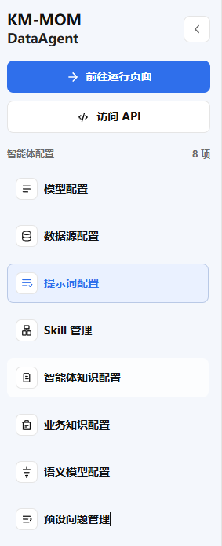
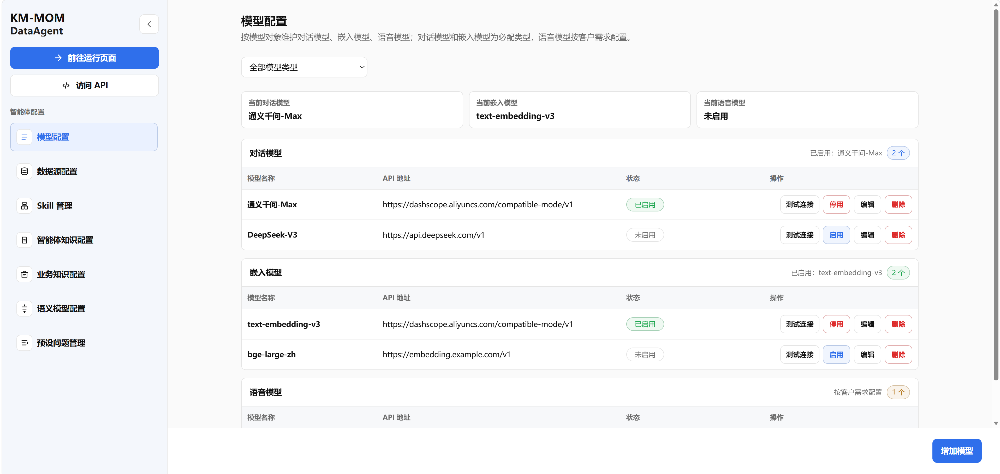
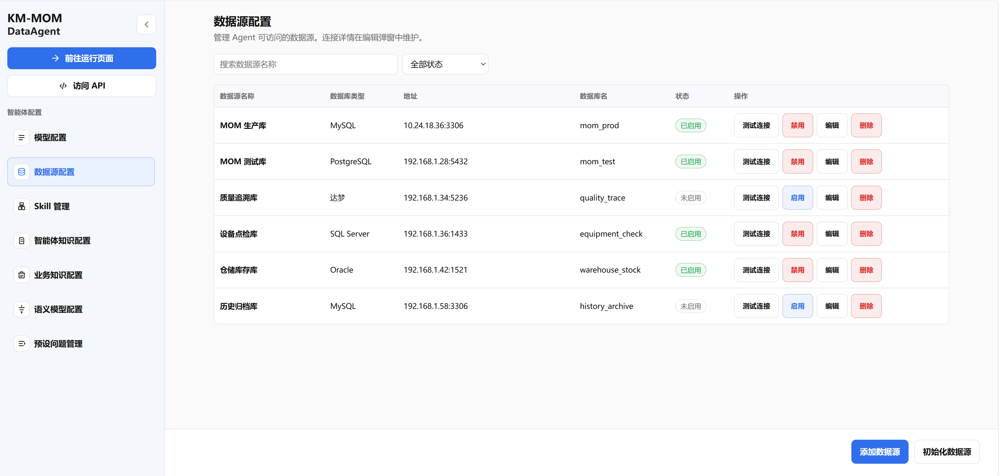
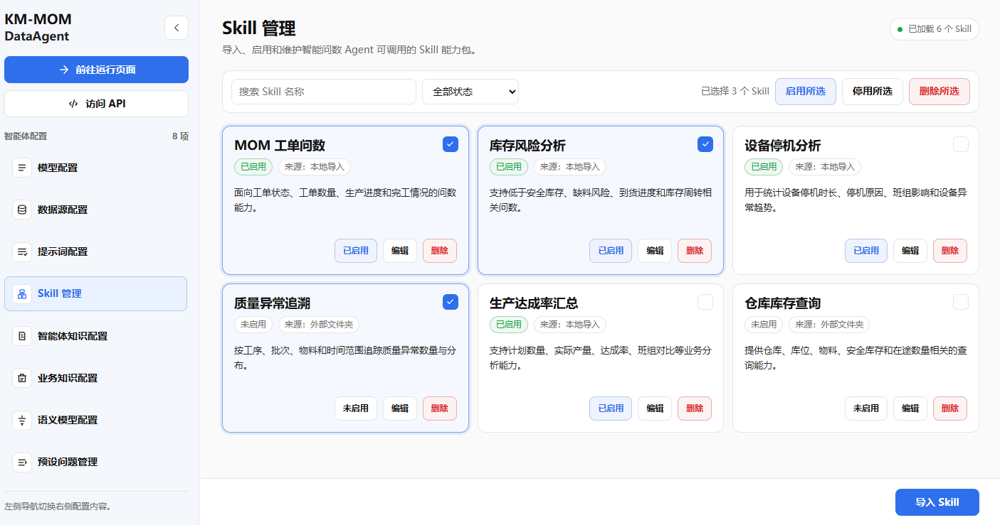
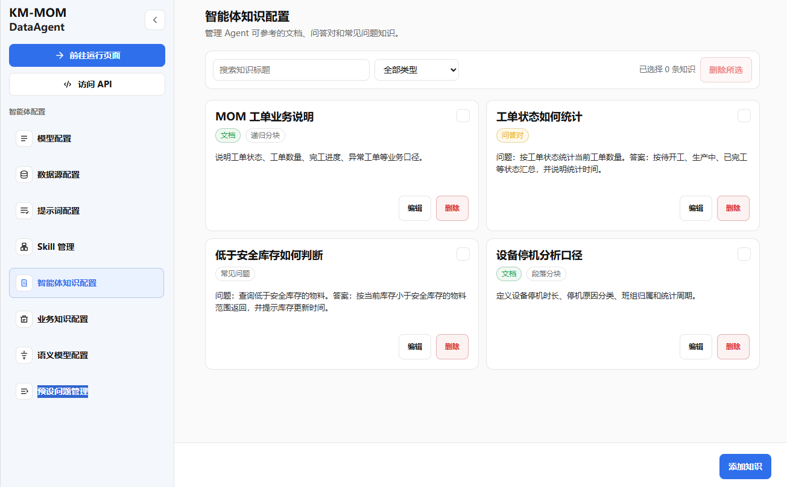
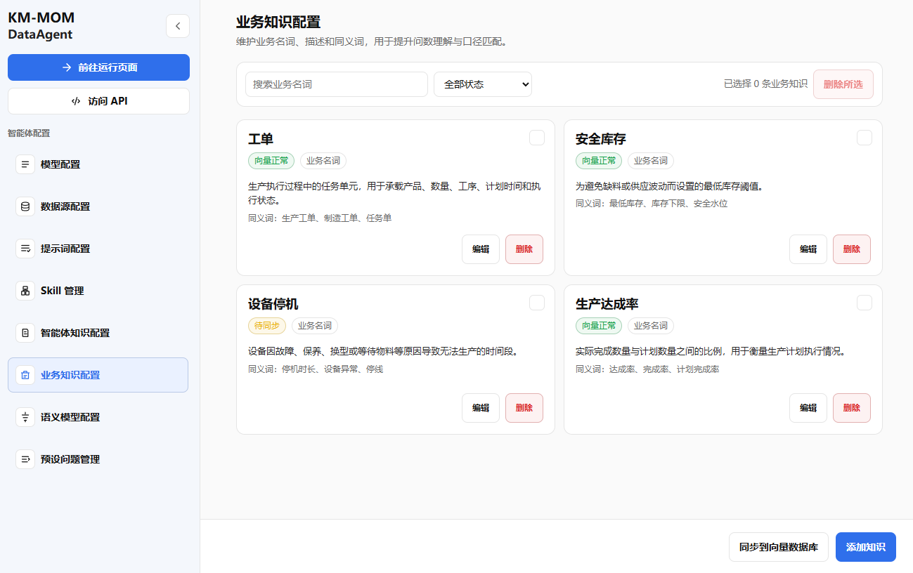
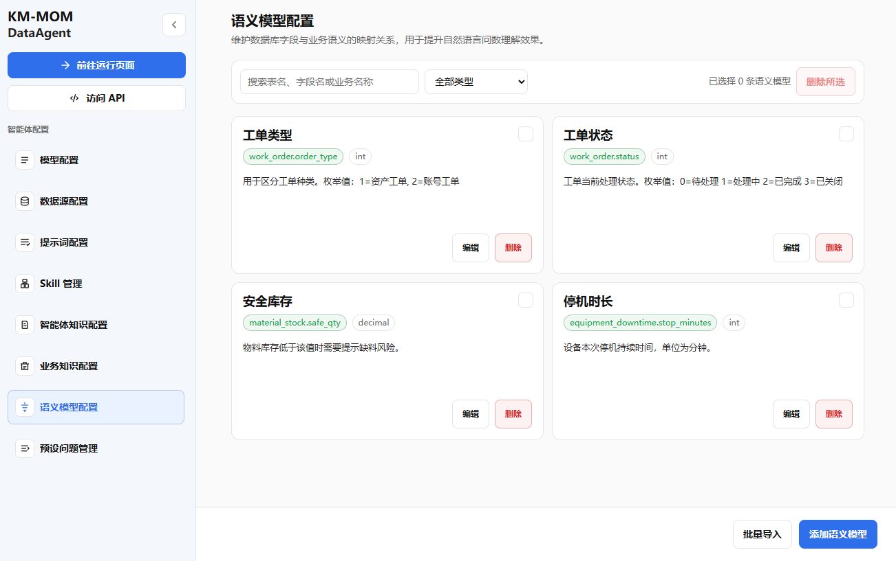
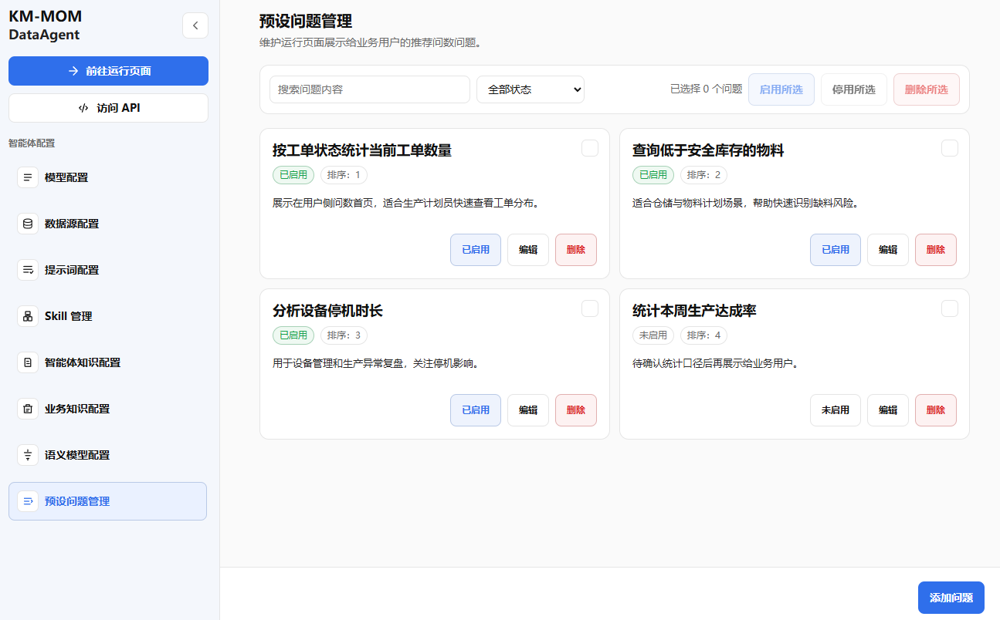
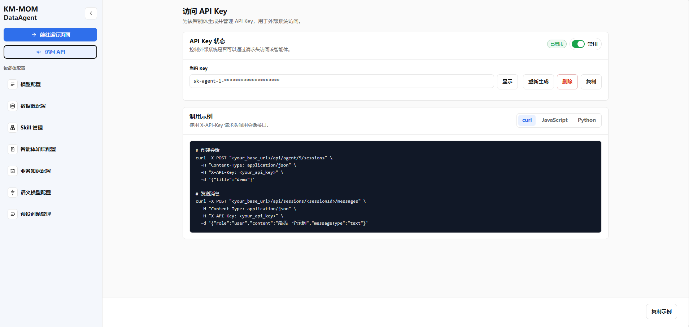

# MOM 智能问数-MVP管理侧需求规格文档

### 1.1 需求背景

MOM 智能问数 MVP 需要先跑通一个默认 Agent 的配置、访问和问数闭环。管理侧用于内部管理员维护默认 Agent 所需的模型、数据源、知识、语义、Skill、预设问题和 API 访问能力，使用户侧问答或外部系统能够基于已配置能力调用默认 Agent 完成自然语言问数。系统提示词在 MVP 阶段内置，不对用户开放修改。

### 1.2 需求目标

本需求需要实现以下目标：

| 目标 | 说明 |
|---|---|
| 支持默认 Agent 配置 | MVP 阶段只支持一个Agent，所有管理侧配置均归属于该 Agent。 |
| 支持基础资源配置 | 管理 LLM、嵌入模型、语音识别能力和业务数据源。 |
| 支持 Agent 能力配置 | 管理智能体知识、业务知识、语义模型和 Skill。 |
| 支持问数使用配置 | 管理用户侧问答展示的预设问题。 |
| 支持外部 API 访问 | 管理默认 Agent 的 API Key 和调用说明，支撑 MOM 平台后端或其他系统通过接口接入问数能力。 |
| 支持配置测试 | 管理员能够测试模型连接、数据源连接、知识召回、Skill 可用性等关键配置。 |
| 支持 MVP 问数闭环 | 配置完成后，用户侧可通过文本或语音方式调用默认 Agent 完成基础问数。 |

### 1.3 适用角色

| 角色 | 使用目标 |
|---|---|
| 内部管理员 | 维护模型、数据源、知识、语义模型、Skill、预设问题和 API 访问配置。 |
| 实施人员 | 根据客户数据和业务口径配置默认 Agent，并完成初始化和验证。 |
| 测试人员 | 基于预设问题和测试问题验证默认 Agent 的问数效果。 |
| 对接开发人员 | 基于访问 API 页面提供的 Key、接口地址和示例代码完成外部系统接入。 |

### 1.4 MVP 范围

- 一个默认 Agent 的配置归属规则
- 模型配置（LLM、嵌入模型、语音识别）
- 数据源配置
- Skill 管理
- 智能体知识配置
- 业务知识配置
- 语义模型配置
- 预设问题管理
- 访问 API
- 文本问数闭环
- 语音问数闭环

### 1.5 非 MVP 范围

- 多 Agent 创建、复制、删除、切换和发布管理
- 客户权限隔离管理
- 完整 Agent 版本管理
- 复杂 Skill 编排
- 长期记忆管理
- 模型成本统计、模型路由和自动降级
- 用户鉴权管理、用户登录注册管理
- 多 API Key 并存、调用方分级授权、Key 有效期配置、IP 白名单、调用配额、流量限制、调用日志统计分析和 API 版本管理

### 1.6 参考材料

| 材料 | 说明 |
|---|---|
| MOM 智能问数项目方案 | 用于确定项目目标、应用架构和阶段边界。 |
| 管理侧页面原型 | 用于确定页面布局和功能模块。 |
| DataAgent 源码 | 用于参考模型配置、数据源、知识、语义模型和 Agent 工作流思路。 |

## 2. 需求描述

### 2.1 业务描述

MVP 阶段采用 **“一个默认 Agent + 管理侧配置 + API 访问 + 用户侧问答”** 的方式。管理员在管理侧完成默认 Agent 的基础配置和 API 访问配置，用户侧负责发起文本问数或语音问数并查看结果，外部系统可在授权后通过接口调用默认 Agent。


关键约束：

- MVP 阶段只有一个默认 Agent。
- 管理侧所有配置默认归属于当前默认 Agent。
- 用户侧不选择 Agent，不接触管理配置。
- 访问 API 是管理侧独立入口，不归属于智能体配置分组。
- 配置不完整时，用户侧 Chat 不应进入正式问数状态。

### 2.2 需求边界及验收条件

#### 2.2.1 包含范围

| 范围 | 说明 |
|---|---|
| 模型配置 | 配置 LLM、Embedding 模型和语音识别能力，并支持测试。 |
| 数据源配置 | 配置业务数据库连接，支持连接测试和 Schema 初始化。 |
| 智能体知识配置 | 管理增强默认 Agent 能力的文档、问答对和 FAQ。 |
| 业务知识配置 | 管理业务术语、状态枚举、业务规则和不可回答边界。 |
| 语义模型配置 | 管理业务对象、字段别名、表关系、指标口径和枚举映射。 |
| Skill 管理 | 管理默认 Agent 可调用的内置 Skill 白名单。 |
| 预设问题管理 | 管理用户侧 Chat 首页或输入区展示的预设问题（用户侧展示为推荐问题）。 |
| 访问 API | 作为管理侧独立入口，管理默认 Agent 的单个 API Key，并提供 `/api/agent/invoke` 调用说明。 |
| 问数闭环 | 支持用户侧通过文本输入或语音输入调用默认 Agent 完成问数。 |

#### 2.2.2 独立测试说明

每个配置模块需支持独立测试或校验：

- 模型配置可测试连接或调用。
- 数据源配置可测试连接和初始化 Schema。
- 语音识别配置可测试服务是否可用。
- 智能体知识配置可测试召回。
- 语义模型配置可进行必填校验和引用关系校验。
- Skill 配置可测试启用状态或模拟调用。
- 预设问题可验证是否在用户侧展示。
- 访问 API 可验证 Key 生成、重置、启停和鉴权失败提示。

#### 2.2.3 MVP 验收条件

| 验收项 | 通过标准 |
|---|---|
| 默认 Agent 可用 | 系统存在一个默认 Agent，管理侧配置均归属于该 Agent。 |
| 模型配置可用 | LLM、嵌入模型、语音识别配置至少完成必填项保存，并能展示测试状态。 |
| 数据源可用 | 数据源连接测试成功，Schema 初始化成功，并可展示表和字段初始化结果。 |
| 业务知识可用 | 至少支持维护业务术语、状态枚举或业务规则。 |
| 语义模型可用 | 至少支持维护业务对象、字段别名、表关系和指标口径中的基础配置。 |
| Skill 可用 | 至少支持 Skill 列表查看、启用/停用和测试入口。 |
| 预设问题可用 | 用户侧 Chat 能展示已启用的预设问题。 |
| 访问 API 可用 | 管理员可生成、重置、删除、启停默认 Agent 的单个 API Key，并可查看 `/api/agent/invoke` 调用说明和示例代码。 |
| 文本问数闭环可用 | 用户侧输入一个基础问数问题后，默认 Agent 能返回结果或明确边界提示。 |
| 语音问数闭环可用 | 用户侧输入一条语音后，系统可完成识别、问数并返回结果或明确边界提示。 |

### 2.3 功能描述

#### 2.3.1 页面总体结构

管理侧菜单分类：

```text
跳转入口
  - 前往运行页面
  - 访问 API

智能体配置
  基础资源配置
    - 模型配置
    - 数据源配置

  Agent 能力配置
    - Skill 管理
    - 智能体知识配置
    - 业务知识配置
    - 语义模型配置

  测试与使用配置
    - 预设问题管理
```

说明：

- “访问 API”为左侧导航独立一级入口，不归属于“智能体配置”分组。
- “智能体配置”分组用于维护默认 Agent 的内部问数能力配置。
- “访问 API”用于外部系统接入默认 Agent，不用于维护模型、数据源、知识或语义等内部配置。

管理菜单原型图（仅供功能参考，不代表最终效果）：


#### 2.3.2 模型配置

| 项目 | 说明 |
|---|---|
| 功能目标 | 配置默认 Agent 使用的 LLM、嵌入模型和语音识别能力 |
| 适用角色 | 管理员 |
| 前置条件 | 默认 Agent 已存在 |
| 触发方式 | 管理侧菜单进入“模型配置” |
| 系统处理逻辑 | 管理员填写模型配置后保存；点击测试按钮时系统发起模型可用性测试并记录状态 |
| 输出结果 | 保存模型配置，展示模型、测试状态和最近测试时间 |
| 异常处理 | 必填项缺失时禁止保存；测试失败时展示失败原因；API Key 脱敏展示 |
| 涉及页面 | 模型配置页 |

模型配置原型图（仅供功能参考，不代表最终效果）：


核心字段：

| 模型类型 | 字段 |
|---|---|
| LLM | 配置名称、供应商、Base URL、API Key、模型名称、温度（Temperature）、最大Token数 |
| 嵌入模型 | 配置名称、供应商、Base URL、API Key、模型名称 |
| 语音识别 | 配置名称、供应商、Base URL、API Key、模型名称 |

验收标准：

- 管理员填写必填项后可保存配置。
- 点击测试连接后，系统展示测试成功或失败原因弹窗。
- API Key 保存后默认脱敏展示。
- 更换嵌入模型时页面需提示Schema、语义配置需要重新初始化。
- 语音识别配置测试成功后，可展示最近测试状态和测试时间。

#### 2.3.3 数据源配置

| 项目 | 说明 |
|---|---|
| 功能目标 | 配置默认 Agent 可访问的数据源，支持连接测试、Schema 初始化和核心表范围选择 |
| 适用角色 | 管理员 |
| 前置条件 | 默认 Agent 已存在 |
| 触发方式 | 管理侧菜单进入“数据源配置” |
| 系统处理逻辑 | 管理员填写连接信息后保存；点击测试连接验证可用性；点击初始化 Schema 读取表和字段信息 |
| 输出结果 | 保存数据源配置，展示连接状态、Schema 初始化状态、表数量、字段数量 |
| 异常处理 | 连接失败时展示失败原因；Schema 初始化失败时保留失败状态和错误说明；密码脱敏展示 |
| 涉及页面 | 数据源配置页 |

数据源配置原型图（仅供功能参考，不代表最终效果）：



核心字段：

| 分组 | 字段 |
|---|---|
| 基础信息 | 数据源名称、数据源类型（MySQL、达梦、Oracle、......）、连接状态、启用状态 |
| 连接配置 | 数据库名称、数据库类型、主机地址、端口、 SQLAlchemy 连接地址、用户名、密码、描述 |
| 安全配置 | 是否只读连接、是否启用危险 SQL 拦截、最大返回行数、查询超时时间、是否记录查询日志 |
| Schema 初始化 | 初始化状态、表数量、最近初始化时间、初始化耗时 |
| 表范围配置 | 核心表白名单、排除表黑名单、表名、表说明、字段数量、是否纳入问数范围、是否核心表 |

验收标准：

- 管理员填写正确连接信息后，点击测试连接返回成功。
- 点击初始化 Schema 后，系统可展示表数量、字段数量和初始化时间。
- 管理员可选择核心表或排除表。
- 数据源连接失败时，系统需展示明确失败提示。

#### 2.3.4 Skill 管理

| 项目         | 说明                                                       |
| ------------ | ---------------------------------------------------------- |
| 功能目标     | 管理默认 Agent 可调用的 Skill 能力白名单                   |
| 适用角色     | 管理员                                                     |
| 前置条件     | 默认 Agent 已存在                                          |
| 触发方式     | 管理侧菜单进入“Skill 管理”                                 |
| 系统处理逻辑 | 管理员查看系统内置 Skill 列表，配置启用状态并进行基础测试  |
| 输出结果     | 保存 Skill 配置，默认 Agent 仅能调用已启用 Skill           |
| 异常处理     | 未启用 Skill 不可被默认 Agent 调用；测试失败时展示失败原因 |
| 涉及页面     | Skill 管理页                                               |

验收标准：

- 管理员可查看 Skill 列表。
- 管理员可启用或停用 Skill。
- 已停用 Skill 不应被默认 Agent 调用。

Skill管理原型图（仅供功能参考，不代表最终效果）：


#### 2.3.5 功能分层说明

智能体知识配置、业务知识配置、语义模型配置这三个页面可以分成两类。智能体知识配置和业务知识配置都属于知识召回，前者管文档、问答对和 FAQ，后者管业务术语、描述、同义词和口径规则，本质上都是把知识沉淀下来，供问数时补上下文、控边界。语义模型配置属于语义约束，不走知识召回，而是把表名、字段名、业务名、同义词、字段注释和类型做成结构化映射，问数时结合表关系和 schema 结果直接进入提示词，用来约束字段理解和指标口径。简单说，前两个页面是“知识沉淀”，后一个页面是“语义约束”。

#### 2.3.6 智能体知识配置

| 项目 | 说明 |
|---|---|
| 功能目标 | 管理增强默认 Agent 能力的知识源，包括文档、问答对和常见问题 |
| 适用角色 | 管理员 |
| 前置条件 | 默认 Agent 已存在；嵌入模型已配置 |
| 触发方式 | 管理侧菜单进入“智能体知识配置”。 |
| 系统处理逻辑 | 管理员新增知识内容，系统保存并按需解析、分块、向量化 |
| 输出结果 | 展示知识列表、知识状态、向量化状态 |
| 异常处理 | 文件解析失败、向量化失败时展示失败状态；未配置嵌入模型时提示先配置 |
| 涉及页面 | 智能体知识配置页 |

知识类型：

- 文档
- 问答对
- 常见问题

文档分块方式：

- 递归分块
- Token 分块
- 句子分块
- 段落分块
- 语义分块

验收标准：

- 管理员可新增文档、问答对或常见问题。
- 文档知识可选择分块方式并触发向量化。
- 向量化成功。

 智能体知识配置原型图（仅供功能参考，不代表最终效果）：


#### 2.3.7 业务知识配置

| 项目 | 说明 |
|---|---|
| 功能目标 | 维护业务名词、业务描述、业务同义词，帮助默认 Agent 理解业务语义 |
| 适用角色 | 管理员 |
| 前置条件 | 默认 Agent 已存在；嵌入模型已配置 |
| 触发方式 | 管理侧菜单进入“业务知识配置” |
| 系统处理逻辑 | 管理员维护业务知识条目，支持启用、停用、标签分类和是否召回 |
| 输出结果 | 保存业务知识配置，并在问数时作为业务约束被召回 |
| 异常处理 | 名称或内容为空时禁止保存；停用知识不参与召回 |
| 涉及页面 | 业务知识配置页 |

验收标准：

- 管理员可新增业务知识条目。
- 已启用业务知识可参与召回。
- 停用业务知识不参与默认 Agent 的问数召回。

 业务知识配置原型图（仅供功能参考，不代表最终效果）：



#### 2.3.8 语义模型配置

| 项目 | 说明 |
|---|---|
| 功能目标 | 维护默认 Agent 的轻量语义配置，包括表名、数据库字段名、业务名称、业务同义词、业务描述、字段注释和数据类型 |
| 适用角色 | 管理员 |
| 前置条件 | 默认 Agent 已存在；数据源已初始化 Schema |
| 触发方式 | 管理侧菜单进入“语义模型配置” |
| 系统处理逻辑 | 管理员基于已初始化 Schema 维护业务对象、字段映射、关系和指标口径 |
| 输出结果 | 保存语义配置，并在问数时用于约束表字段理解、指标计算和关系判断 |
| 异常处理 | 引用不存在表或字段时禁止保存 |
| 涉及页面 | 语义模型配置页 |

验收标准：

- 管理员可创建语义模型。
- 管理员可为字段维护业务别名（同义词）。
- 管理员可维护至少一个语义模型。

语义模型配置原型图（仅供功能参考，不代表最终效果）：



#### 2.3.9 预设问题管理

| 项目 | 说明 |
|---|---|
| 功能目标 | 管理用户侧问答展示的预设问题（用户侧展示为推荐问题）和常用问法 |
| 适用角色 | 管理员 |
| 前置条件 | 默认 Agent 已存在 |
| 触发方式 | 管理侧菜单进入“预设问题管理” |
| 系统处理逻辑 | 管理员新增、编辑、排序和启停预设问题；用户侧问答读取已启用问题展示 |
| 输出结果 | 保存预设问题配置，并在用户侧展示 |
| 异常处理 | 问题内容为空时禁止保存；停用问题不展示 |
| 涉及页面 | 预设问题管理页、用户侧问答页面 |

核心字段：

- 问题标题
- 问题内容
- 问题分类
- 适用角色
- 排序号
- 启用状态
- 是否首页展示

验收标准：

- 管理员可新增预设问题。
- 已启用且设置首页展示的问题可在用户侧问答展示。
- 停用问题不在用户侧展示。
- 管理员可调整预设问题排序。

预设问题管理原型图（仅供功能参考，不代表最终效果）：



#### 2.3.10 访问 API

本功能用于把默认 Agent 暴露为一个可被 MOM 平台后端调用的问数接口。MVP 阶段只做最小闭环：**一个默认 Agent、一个有效 API Key、一个问数调用入口**。

| 项目 | 说明 |
|---|---|
| 功能目标 | 管理默认 Agent 的外部调用凭证，并提供调用说明，使 MOM 平台后端可通过接口调用默认 Agent 问数能力 |
| 适用角色 | 管理员 |
| 前置条件 | 默认 Agent 已存在；LLM 和数据源已完成配置；默认 Agent 问数链路可用 |
| 触发方式 | 点击左侧导航一级按钮“访问 API” |
| 系统处理逻辑 | 管理员生成 API Key 后，系统保存 Key 摘要和脱敏值；外部系统调用问数接口时，后端先校验请求头中的 Key，校验通过后转入默认 Agent 调用链路 |
| 输出结果 | 管理侧展示 API 状态、脱敏 Key、最近生成时间、接口地址、请求头、请求体示例和返回示例 |
| 异常处理 | 未生成 Key 不允许启用 API；Key 错误、已删除或已停用时拒绝调用；默认 Agent 配置不可用时返回配置不可用提示 |
| 涉及页面 | 访问 API 页 |

API访问原型图（仅供功能参考，不代表最终效果）：



页面字段：

| 分组 | 字段 | 说明 |
|---|---|---|
| 默认 Agent 信息 | Agent 名称、Agent 标识 | 只读展示，MVP 阶段不可切换 Agent。 |
| API 状态 | 是否启用、Key 状态、最近生成时间、最近重置时间 | 用于判断外部接口当前是否可用。 |
| Key 管理 | 脱敏 Key、生成 Key、重新生成 Key、删除 Key、复制 Key | 只允许保留一个有效 Key；完整 Key 仅在生成或重置成功后展示一次。 |
| 调用说明 | 接口地址、请求方式、请求头、请求体示例、返回示例 | 给对接开发人员直接参考。 |

处理规则：

1. 访问 API 是独立一级入口，不纳入智能体配置分组。
2. MVP 阶段只支持默认 Agent，不支持选择或切换 Agent。
3. MVP 阶段只支持一个有效 API Key，不支持多 Key 并存。
4. API Key 由系统生成，管理员不可手工录入。
5. 完整 API Key 仅在生成或重置成功后展示一次；再次进入页面只展示脱敏值。
6. 重置 Key 后旧 Key 立即失效。
7. 删除 Key 后外部接口不可继续调用，需重新生成 Key。
8. 停用 API 后，即使 Key 正确也不可调用默认 Agent。
9. 外部接口只负责鉴权和调用默认 Agent，不允许直接访问知识库、语义模型或业务数据库。

验收标准：

- 管理员可进入独立的访问 API 页面。
- 未生成 Key 时，页面提示先生成 Key，API 不可启用。
- 生成 Key 后，页面展示完整 Key 一次，并保存脱敏 Key。
- 重置 Key 后，旧 Key 调用失败，新 Key 调用成功。
- 删除 Key 后，外部接口调用失败。
- 停用 API 后，外部接口调用失败；重新启用后可继续使用当前有效 Key 调用。
- 使用正确 Key 调用 `/api/agent/invoke` 时，系统进入默认 Agent 问数链路并返回结果或边界提示。
- 使用错误 Key 调用时，系统返回鉴权失败，不进入默认 Agent 问数链路。

### 2.4 数据描述

#### 2.4.1 数据模型引用

| 数据模型文档 | 与本需求关系 |
|---|---|
| MOM智能问数-MVP数据模型文档 | 作为本需求的数据对象定义依据，明确默认智能体、模型资源、数据源、Skill、知识、语义字段映射、预设问题、API 访问配置、会话、消息、问数结果等对象的字段口径、对象关系和状态规则。 |

#### 2.4.2 关键配置对象

| 模型 | 属性 | 属性名称 | 与本需求关系 | 说明 |
|---|---|---|---|---|
| 默认智能体 | agentId | 智能体标识 | 配置归属 | MVP 阶段仅存在一个默认智能体，所有管理配置均归属于该对象。 |
| 默认智能体 | agentName | 智能体名称 | 页面展示 | 管理侧顶部和配置归属展示使用。 |
| 模型资源配置 | modelCategory | 模型分类 | 功能配置 | 区分大语言模型、嵌入模型、语音识别模型。 |
| 模型资源配置 | baseUrl | 服务地址 | 功能配置 | 用于模型服务调用。 |
| 模型资源配置 | apiKey | 访问密钥 | 敏感配置 | 页面需脱敏展示。 |
| 模型资源配置 | modelName | 模型名称 | 功能配置 | 标识具体可调用模型。 |
| 数据源配置 | datasourceType | 数据源类型 | 功能配置 | 区分 MySQL、达梦、Oracle、SQL Server、PostgreSQL 等。 |
| 数据源配置 | host | 主机地址 | 功能配置 | 用于连接业务数据库。 |
| 数据源配置 | databaseName | 数据库名称 | 功能配置 | 标识目标业务库。 |
| 数据源配置 | username | 用户名 | 功能配置 | 用于数据源连接。 |
| 数据源配置 | password | 密码 | 敏感配置 | 页面需脱敏展示。 |
| 数据表范围配置 | tableName | 表名 | 问数范围配置 | 标识数据源下可纳入问数范围的数据表。 |
| 数据表范围配置 | inQueryScope | 是否纳入问数范围 | 问数范围配置 | 控制数据表是否进入问数链路。 |
| 数据表范围配置 | isCoreTable | 是否核心表 | 问数范围配置 | 用于标识关键业务表。 |
| Skill 配置 | skillCode | Skill 编码 | 能力白名单 | 标识默认智能体可调用的 Skill。 |
| Skill 配置 | enabledFlag | 启用状态 | 能力白名单 | 控制 Skill 是否可调用。 |
| 智能体知识条目 | knowledgeType | 知识类型 | Agent 能力配置 | 包括文档、问答对、FAQ。 |
| 智能体知识条目 | knowledgeTitle | 知识标题 | Agent 能力配置 | 用于知识列表展示和检索。 |
| 智能体知识条目 | splitterType | 分块方式 | Agent 能力配置 | 用于文档类知识处理。 |
| 智能体知识条目 | answerContent | 答案内容 | Agent 能力配置 | 用于问答对、FAQ 内容沉淀。 |
| 业务知识条目 | termName | 业务名词 | 业务约束 | 标识业务术语对象。 |
| 业务知识条目 | description | 业务描述 | 业务约束 | 用于解释术语含义和业务口径。 |
| 业务知识条目 | synonyms | 同义词 | 业务约束 | 用于业务表达扩展。 |
| 语义字段映射 | tableName | 表名 | 语义约束 | 标识语义映射来源表。 |
| 语义字段映射 | columnName | 字段名 | 语义约束 | 标识语义映射来源字段。 |
| 语义字段映射 | businessName | 业务名称 | 语义约束 | 标识字段对应的业务化名称。 |
| 语义字段映射 | synonyms | 同义词 | 语义约束 | 扩展字段的业务表达。 |
| 预设问题条目 | questionContent | 问题内容 | 用户侧展示 | 用于用户侧展示推荐问法。 |
| 预设问题条目 | sortOrder | 排序号 | 用户侧展示 | 控制展示顺序。 |
| API 访问配置 | keyDigest | Key 摘要 | 外部接入 | 用于外部系统调用默认 Agent 时鉴权，不保存明文。 |
| API 访问配置 | maskedKey | 脱敏 Key | 外部接入 | 用于页面展示当前 Key 的脱敏结果。 |
| API 访问配置 | apiEnabledFlag | API 启用状态 | 外部接入 | 控制外部系统是否允许通过 API 调用默认 Agent。 |
| API 访问配置 | generatedTime | 生成时间 | 外部接入 | 用于展示 Key 最近一次生成时间。 |
| API 访问配置 | resetTime | 重置时间 | 外部接入 | 用于展示 Key 最近一次重置时间。 |
| 系统提示词 | promptContent | 系统提示词内容 | 内置能力 | 由系统内置，用于约束默认智能体行为，不对用户开放修改。 |

#### 2.4.3 状态字段

| 模型 | 属性 | 属性名称 | 业务含义 | 使用场景 | 说明 |
|---|---|---|---|---|---|
| 模型资源配置 | testStatus | 测试状态 | 标识模型服务是否可用 | 模型配置页 | 未测试、成功、失败。 |
| 模型资源配置 | defaultFlag | 生效状态 | 标识当前是否为生效配置 | 模型配置页 | 同一模型分类下仅允许一条生效配置。 |
| 数据源配置 | connectStatus | 连接状态 | 标识数据源连接是否可用 | 数据源配置页 | 未测试、成功、失败。 |
| 数据源配置 | schemaInitStatus | 初始化状态 | 标识表结构是否已初始化 | 数据源配置页 | 未初始化、初始化中、成功、失败。 |
| 数据表范围配置 | inQueryScope | 是否纳入问数范围 | 控制表是否进入问数链路 | 数据源配置页 | 是、否。 |
| Skill 配置 | enabledFlag | 启用状态 | 控制默认智能体是否可调用 | Skill 管理页 | 启用、停用。 |
| 智能体知识条目 | recallFlag | 召回状态 | 控制知识是否参与问数召回 | 智能体知识配置页 | 召回、取消召回。 |
| 智能体知识条目 | vectorStatus | 向量状态 | 标识知识处理结果 | 智能体知识配置页 | 待处理、处理中、成功、失败。 |
| 业务知识条目 | recallFlag | 召回状态 | 控制业务知识是否参与问数召回 | 业务知识配置页 | 召回、取消召回。 |
| 业务知识条目 | vectorStatus | 向量状态 | 标识业务知识处理结果 | 业务知识配置页 | 待处理、处理中、成功、失败。 |
| 语义字段映射 | enabledFlag | 启用状态 | 控制语义映射是否参与问数约束 | 语义模型配置页 | 启用、停用。 |
| 预设问题条目 | enabledFlag | 启用状态 | 控制问题是否在用户侧展示 | 预设问题管理页 | 启用、停用。 |
| API 访问配置 | apiEnabledFlag | API 启用状态 | 控制外部接口是否可访问默认 Agent | 访问 API 页 | 启用、停用。 |
| API 访问配置 | keyStatus | Key 状态 | 标识当前 Key 是否可用 | 访问 API 页 | 未生成、有效、已删除、已失效。 |

#### 2.4.4 配置数据类别

| 类别 | 名称 | 载体 | 用途 | 是否必需 | 说明 |
|---|---|---|---|---|---|
| 基础资源 | 模型资源配置 | 管理侧配置表 | 支撑默认智能体调用模型 | 是 | 至少配置大语言模型、嵌入模型和语音识别模型。 |
| 基础资源 | 数据源配置 | 管理侧配置表 | 支撑默认智能体访问业务数据 | 是 | 至少配置一个数据源。 |
| 基础资源 | 数据表范围配置 | 管理侧配置表 | 控制哪些表进入问数范围 | 是 | 与数据源初始化和语义配置联动。 |
| Agent 能力 | 系统提示词 | 系统内置配置 | 约束默认智能体行为 | 是 | 系统内置，不对用户开放修改。 |
| Agent 能力 | Skill 配置 | 管理侧配置表 | 控制默认智能体可调用能力 | 是 | 本期纳入管理范围。 |
| Agent 能力 | 智能体知识条目 | 知识库 / 向量索引 | 增强默认智能体知识召回能力 | 是 | 支持文档、问答对、FAQ。 |
| Agent 能力 | 业务知识条目 | 配置表 / 向量索引 | 约束 MOM 业务理解 | 是 | 用于维护术语、描述和同义词。 |
| 语义约束 | 语义字段映射 | 配置表 | 约束字段理解和业务口径 | 是 | 用于表字段到业务字段的结构化映射。 |
| 展示配置 | 预设问题条目 | 配置表 | 用户侧预设问题（推荐问题）展示 | 是 | 用于引导用户发起问数。 |
| 外部接入 | API 访问配置 | 配置表 | 支撑外部系统通过 `/api/agent/invoke` 调用默认 Agent | 是 | 仅保存 Key 摘要和脱敏值，重置或删除后旧 Key 立即失效。 |

### 2.5 状态规则

| 状态 | 适用对象 | 说明 |
|---|---|---|
| 未配置 | 模型、数据源等 | 配置尚未创建或必填项不完整。 |
| 已启用 | Skill、语义字段映射、预设问题、API 访问配置等 | 当前处于可用状态，参与问数、展示或外部调用。 |
| 已停用 | Skill、语义字段映射、预设问题、API 访问配置等 | 当前不参与问数、用户侧展示或外部调用。 |
| 未生成 | API Key | 尚未生成可用于外部访问的 Key。 |
| 已失效 | API Key | Key 已被重置、删除或停用，不允许继续访问默认 Agent。 |
| 未测试 | 模型资源、数据源 | 尚未进行测试。 |
| 测试成功 | 模型资源、数据源 | 最近一次测试成功。 |
| 测试失败 | 模型资源、数据源 | 最近一次测试失败，需要展示失败原因。 |
| 未初始化 | 数据源 Schema | 尚未执行表结构初始化。 |
| 初始化中 | 数据源 Schema | 正在读取表和字段。 |
| 初始化成功 | 数据源 Schema | 已完成初始化。 |
| 初始化失败 | 数据源 Schema | 初始化失败，需要展示失败原因。 |
| 待处理 | 智能体知识、业务知识 | 已保存，等待进入向量处理。 |
| 处理中 | 智能体知识、业务知识 | 正在执行向量化或解析处理。 |
| 处理成功 | 智能体知识、业务知识 | 已完成处理，可参与召回。 |
| 处理失败 | 智能体知识、业务知识 | 处理失败，需要展示失败原因。 |

### 2.6 异常处理

| 异常场景 | 处理规则 |
|---|---|
| 模型测试失败 | 展示失败原因，状态更新为测试失败，不影响已保存配置。 |
| 语音识别测试失败 | 展示失败原因，状态更新为测试失败，不进入语音问数流程。 |
| 数据源连接失败 | 展示失败原因，不允许执行 Schema 初始化。 |
| Schema 初始化失败 | 展示失败原因，保留原有成功 Schema 信息不被覆盖。 |
| 嵌入模型未配置 | 智能体知识向量化入口提示先配置嵌入模型。 |
| 知识向量化失败 | 展示失败状态和失败原因，支持重新向量化。 |
| 语义配置引用字段不存在 | 禁止保存并提示选择有效表字段。 |
| Skill 测试失败 | 展示失败原因，不影响启停状态。 |
| 语音输入为空或识别结果为空 | 提示重新录入，不进入问数。 |
| 语音识别服务超时或不可用 | 提示服务异常，支持重新发起语音输入。 |
| 预设问题内容为空 | 禁止保存并提示补充问题内容。 |
| 未生成 API Key | 禁止启用 API 访问，并提示先生成 Key。 |
| API Key 错误、已删除或已停用 | 外部调用返回鉴权失败或访问不可用提示，不进入问数链路。 |
| 有未保存修改 | 离开页面前提示保存或放弃修改。 |

### 2.7 接口需求

| 调用关系 | 用途 | 输入 | 输出 | 失败处理 |
|---|---|---|---|---|
| 管理侧保存模型配置 | 保存 LLM、嵌入模型、语音识别配置 | 模型配置表单 | 保存结果、配置状态 | 返回失败原因，页面保留填写内容。 |
| 管理侧测试模型 | 验证模型是否可用 | 模型配置、测试内容 | 测试状态、响应耗时、失败原因 | 状态更新为测试失败。 |
| 管理侧保存数据源 | 保存数据源连接配置 | 数据源表单 | 保存结果 | 返回失败原因。 |
| 管理侧测试数据源连接 | 验证数据源是否可连接 | 数据源配置 | 连接状态、失败原因 | 禁止进入 Schema 初始化。 |
| 管理侧初始化 Schema | 读取表、字段、字段说明 | 数据源标识 | 表数量、字段数量、初始化状态 | 保留失败原因，支持重新初始化。 |
| 管理侧保存知识 | 保存文档、问答对、FAQ | 知识内容 | 保存状态、处理状态 | 返回失败原因。 |
| 管理侧知识召回测试 | 验证知识是否可被召回 | 测试问题、TopK | 命中知识、相似度、片段 | 无命中时展示空结果。 |
| 管理侧保存语义模型 | 保存业务对象、字段别名、表关系、指标口径 | 语义配置 | 保存结果 | 引用无效时返回校验错误。 |
| 管理侧测试 Skill | 验证 Skill 是否可调用 | Skill 标识、测试参数 | 测试结果、失败原因 | 状态更新为测试失败。 |
| 管理侧生成或重置 API Key | 为默认 Agent 生成唯一外部访问凭证 | 默认 Agent 标识、操作类型 | 完整 Key、脱敏 Key、生成时间、Key 状态 | 生成失败时返回失败原因，旧 Key 状态不变。 |
| 管理侧启停或删除 API Key | 控制默认 Agent 外部访问能力 | 默认 Agent 标识、Key 标识、操作类型 | 操作结果、当前访问状态 | 失败时返回失败原因，页面保留原状态。 |
| 外部系统调用默认 Agent | 外部系统通过 `POST /api/agent/invoke` 执行问数 | 请求头 `X-API-Key`、用户问题、会话标识 | 问数结果、图表、报告或边界提示 | Key 错误、已删除或已停用时返回鉴权失败。 |
| 用户侧获取预设问题 | 用户侧 Chat 展示预设问题（推荐问题） | 默认 Agent 标识 | 预设问题列表 | 获取失败时展示空状态。 |
| 用户侧语音识别 | 将用户语音转换为文本 | 音频内容、语音识别配置 | 识别文本、识别状态、失败原因 | 返回失败原因并提示重新录入。 |
| 用户侧调用默认 Agent | 执行问数 | 用户问题、会话信息 | 问数结果、图表、报告或边界提示 | 返回错误原因或边界提示。 |

## 3. 影响范围分析

| 影响范围 | 说明 |
|---|---|
| 管理侧菜单 | 需新增基础资源配置、Agent 能力配置、测试与使用配置相关菜单，并提供独立的访问 API 一级入口。 |
| 用户侧 Chat | 需读取预设问题，并调用默认 Agent 完成问数。 |
| 外部系统接入 | 需提供默认 Agent 的 `POST /api/agent/invoke` 调用说明、鉴权方式和调用示例。 |
| 默认 Agent 运行链路 | 需读取模型、数据源、系统提示词、知识、语义模型和 Skill 配置。 |
| 配置数据 | 需新增模型、数据源、知识、业务知识、语义模型、Skill、预设问题、API 访问配置等配置对象；系统提示词以内置方式提供。 |
| 安全控制 | 模型 API Key、外部访问 API Key、数据库密码需脱敏展示；外部访问 API Key 不保存明文；数据源建议只读；危险 SQL 拦截配置需生效。 |
| 测试流程 | 每个配置模块需支持基础测试或校验，支撑 MVP 验收。 |
| 后续扩展 | 数据结构需预留默认 Agent 归属字段，便于后续扩展多 Agent，但本阶段不开放多 Agent 功能。 |

## 4. 测试要点及典型样例

### 4.1 正常场景

| 测试点 | 测试说明 | 期望结果 |
|---|---|---|
| 模型配置保存 | 填写 LLM 必填信息并保存。 | 保存成功，状态展示为未测试或测试成功。 |
| 模型连接测试 | 点击 LLM 测试连接。 | 展示测试成功或失败原因。 |
| 语音识别测试 | 填写语音识别必填信息并测试。 | 展示测试成功或失败原因。 |
| 数据源连接测试 | 填写正确数据库连接信息并测试。 | 返回连接成功。 |
| Schema 初始化 | 数据源连接成功后点击初始化 Schema。 | 展示表数量、字段数量和初始化成功状态。 |
| 业务知识启用 | 新增业务术语并启用。 | 业务知识可参与召回测试。 |
| 语义对象配置 | 创建业务对象并关联数据表。 | 保存成功。 |
| Skill 启用 | 启用一个 Skill。 | 默认 Agent 可调用该 Skill。 |
| 预设问题展示 | 新增并启用预设问题。 | 用户侧 Chat 展示该问题。 |
| API Key 生成 | 进入访问 API 页面并生成 Key。 | 页面展示完整 Key 一次，并记录生成时间。 |
| 外部 API 调用 | 使用正确 API Key 调用 `POST /api/agent/invoke`。 | 返回问数结果或明确边界提示。 |
| 默认 Agent 问数 | 用户侧输入基础问数问题。 | 返回问数结果或明确边界提示。 |
| 语音问数 | 用户侧输入一条语音。 | 系统完成识别、问数并返回结果或明确边界提示。 |

### 4.2 异常场景

| 测试点 | 测试说明 | 期望结果 |
|---|---|---|
| LLM 配置缺少 API Key | 保存模型配置。 | 禁止保存并提示必填项。 |
| 模型地址错误 | 点击测试连接。 | 展示测试失败原因。 |
| 语音识别服务不可用 | 点击语音识别测试或发起语音输入。 | 展示失败原因并支持重试。 |
| 数据源密码错误 | 点击测试连接。 | 展示连接失败原因。 |
| 未连接成功初始化 Schema | 点击初始化 Schema。 | 禁止初始化并提示先测试连接。 |
| 嵌入模型未配置时向量化 | 对知识执行向量化。 | 提示先配置嵌入模型。 |
| 语义配置引用不存在字段 | 保存语义配置。 | 禁止保存并提示字段无效。 |
| Skill 停用后调用 | 默认 Agent 尝试调用停用 Skill。 | 不允许调用该 Skill。 |
| 语音输入为空 | 用户侧提交空音频或无有效语音内容。 | 提示重新录入，不进入问数。 |
| 预设问题停用 | 用户侧刷新预设问题（推荐问题）。 | 停用问题不展示。 |
| API Key 错误 | 外部系统使用错误 Key 调用默认 Agent。 | 返回鉴权失败，不进入问数链路。 |
| API 访问停用 | 停用 API 访问后继续调用。 | 返回访问不可用提示。 |
| 系统提示词不可修改 | 管理侧查看默认 Agent 配置。 | 不提供系统提示词编辑入口。 |

### 4.3 边界条件

| 测试点 | 测试说明 | 期望结果 |
|---|---|---|
| 单默认 Agent | 管理侧各配置页面查看当前 Agent。 | 均展示同一个默认 Agent，不提供切换。 |
| 配置变更后未保存 | 编辑后离开页面。 | 提示有未保存修改。 |
| 知识召回无命中 | 输入与知识无关的问题测试召回。 | 展示无命中结果，不报错。 |
| Schema 重新初始化 | 已初始化后再次初始化。 | 更新初始化时间和结果，失败时不覆盖原成功信息。 |
| 预设问题排序 | 调整多个问题顺序。 | 用户侧按排序展示。 |
| API Key 重置 | 重置 API Key 后使用旧 Key 调用。 | 旧 Key 立即失效，新 Key 可用。 |
| 单 Key 限制 | 尝试为默认 Agent 同时保留多个 Key。 | MVP 阶段不支持多 Key 并存，仅保留当前有效 Key。 |

