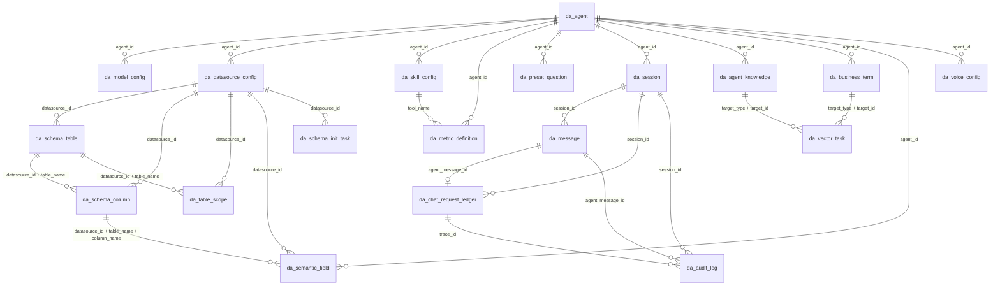

# MOM 智能问数 MVP ER 图

本文档用于说明 MVP 阶段系统库的核心实体关系。当前 DDL 暂不使用数据库外键强约束，优先使用唯一索引、普通索引和 Service 层校验降低早期联调成本。

## 1. 核心关系图

## 2. 实体分组

| 分组 | 表 | 说明 |
| --- | --- | --- |
| Agent 基础配置 | `da_agent` | MVP 默认 Agent |
| 管理侧核心配置 | `da_model_config`、`da_datasource_config`、`da_skill_config`、`da_metric_definition`、`da_preset_question` | 支撑默认 Agent、模型、数据源、工具、指标口径和预设问题 |
| Schema 与语义 | `da_schema_table`、`da_schema_column`、`da_table_scope`、`da_semantic_field` | 缓存外部业务库结构和问数范围，不复制 MOM 业务明细数据 |
| 问数运行 | `da_session`、`da_message`、`da_chat_request_ledger` | 保存会话、消息、最终结果载荷和幂等台账 |
| 知识与语音 | `da_agent_knowledge`、`da_business_term`、`da_voice_config` | 支撑知识召回、业务术语和语音输入配置 |
| 任务与审计 | `da_schema_init_task`、`da_vector_task`、`da_audit_log` | 记录 Schema 初始化、向量化和问数审计 |

## 3. 数据库约束

| 表 | 约束 | 作用 |
| --- | --- | --- |
| `da_agent` | `uk_agent_id` | Agent 业务 ID 唯一 |
| `da_agent` | `uk_default_agent` | MVP 只允许一个未删除默认 Agent |
| `da_model_config` | `uk_model_config_id` | 模型配置业务 ID 唯一 |
| `da_model_config` | `uk_active_default_model` | 同一 Agent 同一模型类别只允许一个启用默认配置 |
| `da_datasource_config` | `uk_datasource_id` | 数据源业务 ID 唯一 |
| `da_datasource_config` | `uk_active_datasource` | 同一 Agent 只允许一个启用 active 数据源 |
| `da_schema_table` | `uk_schema_datasource_table` | 同一数据源下表缓存唯一 |
| `da_schema_column` | `uk_schema_datasource_table_column` | 同一数据源下字段缓存唯一 |
| `da_table_scope` | `uk_datasource_table` | 同一数据源下问数范围配置唯一 |
| `da_skill_config` | `uk_active_skill_code` | 启用且未删除的 Skill Code 在同一 Agent 下唯一 |
| `da_skill_config` | `uk_active_tool_name` | 启用且未删除的 Tool Name 在同一 Agent 下唯一 |
| `da_metric_definition` | `uk_metric_version` | 同一 Agent 同一指标版本唯一 |
| `da_metric_definition` | `uk_active_default_metric` | 已发布默认指标口径在同一 Agent 下唯一 |
| `da_voice_config` | `uk_agent_voice_config` | 同一 Agent 一份语音配置 |
| `da_session` | `uk_session_id` | 会话业务 ID 唯一 |
| `da_message` | `uk_message_id` | 消息业务 ID 唯一 |
| `da_message` | `uk_session_user_role` | 同一会话、用户消息、角色只允许一条消息 |
| `da_chat_request_ledger` | `uk_session_user_message` | `session_id + user_message_id` 是问答幂等事实来源 |
| `da_schema_init_task` | `uk_task_id` | Schema 初始化任务 ID 唯一 |
| `da_vector_task` | `uk_task_id` | 向量化任务 ID 唯一 |
| `da_audit_log` | `uk_audit_id` | 审计 ID 唯一 |

## 4. Service 层校验关系

| 关系 | 校验规则 |
| --- | --- |
| `da_model_config.agent_id -> da_agent.agent_id` | 保存或启用模型配置前，确认 Agent 存在且未删除 |
| `da_datasource_config.agent_id -> da_agent.agent_id` | 保存或启用数据源前，确认 Agent 存在且未删除 |
| `da_skill_config.agent_id -> da_agent.agent_id` | 启用 Skill 前，确认 Agent 存在且未删除 |
| `da_metric_definition.tool_name -> da_skill_config.tool_name` | 发布默认指标前，确认对应 Skill 启用且未删除 |
| `da_preset_question.agent_id -> da_agent.agent_id` | 保存预设问题前，确认 Agent 存在且未删除 |
| `da_schema_table.datasource_id -> da_datasource_config.datasource_id` | Schema 初始化前，确认数据源启用、active、只读且未删除 |
| `da_schema_column.datasource_id + table_name -> da_schema_table.datasource_id + table_name` | 写入字段缓存前，确认表缓存存在 |
| `da_table_scope.datasource_id + table_name -> da_schema_table.datasource_id + table_name` | 调整问数范围前，确认表缓存存在 |
| `da_semantic_field.datasource_id + table_name + column_name -> da_schema_column.datasource_id + table_name + column_name` | 保存语义字段前，确认字段缓存存在 |
| `da_session.agent_id -> da_agent.agent_id` | 创建会话前，确认 Agent 可用 |
| `da_message.session_id -> da_session.session_id` | 保存消息前，确认会话存在且未删除 |
| `da_message.user_message_id -> da_message.message_id` | 保存 Agent 回复前，确认用户消息存在 |
| `da_chat_request_ledger.session_id + user_message_id -> da_message.session_id + message_id` | 处理问答前，优先按台账判断幂等，避免重复调用工具 |
| `da_chat_request_ledger.agent_message_id -> da_message.message_id` | 台账进入终态时，确认 Agent 回复消息存在或记录持久化失败 |
| `da_audit_log.trace_id -> da_chat_request_ledger.trace_id` | 写审计时使用同一 `trace_id` 串联请求台账、消息和工具调用 |
| `da_vector_task.target_id -> da_agent_knowledge.knowledge_id` | `target_type=AGENT_KNOWLEDGE` 时校验知识记录存在 |
| `da_vector_task.target_id -> da_business_term.term_id` | `target_type=BUSINESS_TERM` 时校验业务术语存在 |

## 5. 关键链路说明

### 5.1 默认配置链路

1. `da_agent` 保存 MVP 默认 Agent。
2. `da_model_config` 保存 `LLM` 与 `EMBEDDING` 默认模型。
3. `da_datasource_config` 保存唯一 active 只读业务数据源。
4. `da_skill_config` 保存三个内置工具。
5. `da_metric_definition.status='PUBLISHED' AND default_flag=1` 是可调用指标口径事实来源。
6. `da_preset_question` 保存首页预设问题。

### 5.2 Schema 与语义链路

1. 后端从 `da_datasource_config` 读取 active 数据源配置。
2. Schema 初始化写入 `da_schema_table` 和 `da_schema_column`。
3. `da_table_scope.in_query_scope=1` 决定哪些表可进入问数。
4. `da_semantic_field` 必须能在 Schema 缓存中找到对应字段。

### 5.3 问数运行链路

1. 用户创建或复用 `da_session`。
2. 用户发送问题后先落 `da_message.message_role=USER`。
3. 后端按 `session_id + user_message_id` 写入或查询 `da_chat_request_ledger`。
4. Agent 回复保存为 `da_message.message_role=AGENT`。
5. 最终结果载荷保存在 `da_message.metadata_json.resultPayload`。
6. `da_chat_request_ledger.request_status` 记录 `RECEIVED / PROCESSING / SUCCEEDED / PERSIST_FAILED / FAILED / STOPPED`。
7. `da_audit_log.trace_id` 串联请求台账、消息和审计记录。

### 5.4 任务与 Redis 边界

1. `da_schema_init_task` 和 `da_vector_task` 保存任务最终状态。
2. Redis 中的 `da:schema-task:{taskId}` 和 `da:vector-task:{taskId}` 只用于短期观测、日志排查和失败恢复。
3. Redis Key 过期或丢失不影响 MySQL 中任务最终状态。

## 6. 后置表

以下表不纳入 MVP ER 图和 DDL：

- `da_query_result`
- `da_table_result`
- `da_indicator_result`
- `da_chart_result`
- `da_runtime_notice`
- `da_voice_record`
- `da_api_docs`
- `da_system_prompt`
- `da_api_invoke_log`
